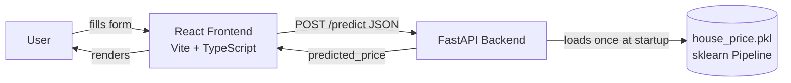

# House Price Prediction — End-to-End ML Web App

Predicts property prices from listing details (location, area, floor, furnishing, etc.)
using a scikit-learn regression pipeline served through a FastAPI backend and a
React + TypeScript frontend.

## Overview

1. A Jupyter notebook cleans a messy real-world listings dataset, trains and compares
   regression models, and exports a single scikit-learn `Pipeline` (preprocessing +
   model) as `house_price.pkl`.
2. A FastAPI backend loads that pipeline once at startup and exposes `POST /predict`.
3. A React frontend collects property details in a form and shows the predicted price.

## Architecture



## Tech stack

| Layer      | Tools |
|------------|-------|
| Modeling   | pandas, scikit-learn, matplotlib, seaborn, Jupyter |
| Backend    | FastAPI, Pydantic v2, Uvicorn, joblib |
| Frontend   | React 18, TypeScript, Vite, React Router |
| Testing    | pytest, httpx (backend); `tsc` type-check (frontend) |

## Project structure

```
house-price-project/
├── notebooks/
│   ├── house_price_model.ipynb   # cleaning, EDA, training, export
│   ├── house_price.pkl           # exported model (copied into backend/models/)
│   ├── locations.json            # allowed location list (copied into backend/models/)
│   └── data/                     # put house_prices.csv here (gitignored)
├── backend/
│   ├── app/
│   │   ├── main.py               # FastAPI app, CORS, lifespan model loading
│   │   ├── api/routes/prediction.py
│   │   ├── core/config.py
│   │   ├── schemas/prediction.py
│   │   ├── services/preprocessing.py
│   │   ├── services/inference.py
│   │   └── utils/logging_config.py
│   ├── models/house_price.pkl
│   ├── tests/test_prediction.py
│   ├── requirements.txt
│   ├── .env.example
│   └── Dockerfile
└── frontend/
    ├── src/
    │   ├── api/predictionClient.ts
    │   ├── components/PredictionForm.tsx
    │   ├── pages/HomePage.tsx | ResultPage.tsx | NotFoundPage.tsx
    │   ├── types/prediction.ts
    │   └── App.tsx
    ├── public/locations.json
    └── .env.example
```

## Dataset

**House Price** by Juhi Bhojani — <https://www.kaggle.com/datasets/juhibhojani/house-price>
(~187,000 real property listings from India).

Download it before running the notebook:

```bash
pip install kaggle
# Get your API token: Kaggle → Settings → API → "Create New Token"
# Place kaggle.json in C:\Users\<you>\.kaggle\ (Windows) or ~/.kaggle/ (macOS/Linux)
kaggle datasets download -d juhibhojani/house-price -p notebooks/data --unzip
```

Or download manually from the link above and place `house_prices.csv` in `notebooks/data/`.

> **Note:** the `house_price.pkl` and `locations.json` committed in this repo were produced
> from a small synthetic placeholder dataset (used to verify the whole pipeline end-to-end
> in an environment without Kaggle access). Re-run the notebook against the real dataset
> before treating the model as production-ready — the code does not need to change.

## Running the notebook

```bash
cd notebooks
python -m venv .venv
source .venv/bin/activate        # Windows: .venv\Scripts\activate
pip install jupyter pandas numpy scikit-learn matplotlib seaborn joblib
jupyter notebook house_price_model.ipynb
```

Run all cells top-to-bottom. It produces `house_price.pkl` and `locations.json` — copy
both into `backend/models/`.

## Running the backend

```bash
cd backend
python -m venv .venv
source .venv/bin/activate        # Windows: .venv\Scripts\activate
pip install -r requirements.txt
cp .env.example .env
uvicorn app.main:app --reload
```

Open <http://localhost:8000/docs> to try `/predict` from the Swagger UI.

Run tests:

```bash
pytest
```

### Backend environment variables

| Variable         | Default                        | Description                              |
|-------------------|--------------------------------|-------------------------------------------|
| `APP_NAME`        | `House Price Prediction API`   | Display name for the app                 |
| `MODEL_PATH`       | `models/house_price.pkl`       | Path to the exported pipeline            |
| `LOCATIONS_PATH`   | `models/locations.json`        | Path to the allowed-locations list       |
| `CORS_ORIGINS`     | `["http://localhost:5173"]`    | Origins allowed to call the API          |

## Running the frontend

```bash
cd frontend
npm install
cp .env.example .env
npm run dev
```

Open <http://localhost:5173>.

### Frontend environment variables

| Variable               | Default                  | Description                  |
|--------------------------|---------------------------|-------------------------------|
| `VITE_API_BASE_URL`      | `http://localhost:8000`   | Base URL of the FastAPI backend |

## API reference

### `GET /health`

```bash
curl http://localhost:8000/health
```

```json
{ "status": "ok" }
```

### `POST /predict`

```bash
curl -X POST http://localhost:8000/predict \
  -H "Content-Type: application/json" \
  -d '{
    "location": "Location_1",
    "carpet_area_sqft": 1200,
    "floor_num": 3,
    "bathroom": 2,
    "balcony": 1,
    "furnishing": "Semi-Furnished",
    "transaction": "Resale",
    "ownership": "Freehold",
    "facing": "East"
  }'
```

```json
{ "predicted_price": 4123456.78 }
```

## Model metrics

Measured on the held-out test set (20% split). Numbers below are from the placeholder
synthetic dataset used to verify the pipeline — re-run the notebook on the real Kaggle
dataset and update this table before submitting.

| Model                        | MAE       | RMSE      | R²    |
|-------------------------------|-----------|-----------|-------|
| Linear Regression (baseline)  | 2,103,187 | 2,807,976 | 0.798 |
| **Random Forest (chosen)**    | **2,098,590** | **2,798,743** | **0.799** |
| Random Forest (log target)    | 2,230,490 | 3,001,198 | 0.769 |

Random Forest was selected as the final model — it had the lowest RMSE and MAE among the
compared models on the test set.

## Screenshots

_Add screenshots of the running form and result page here after you run the app locally
end-to-end (backend on :8000, frontend on :5173)._

## Verifying like a stranger

Clone this repo into a fresh folder and follow only the setup steps above (notebook →
backend → frontend). If any step fails, fix this README.
